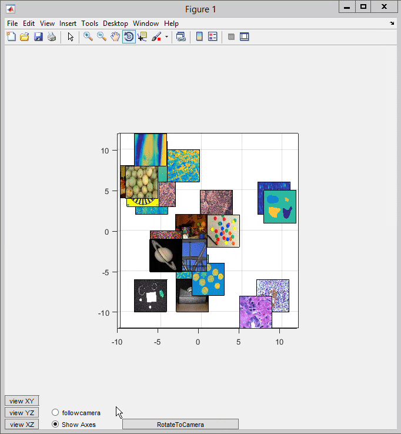

# PicturePlot
A matlab package designed to help in visualizing multidimensional scaling (MDS) solutions for sets of images. 

If hooked up properly like the demo.m file demonstrates, the PicturePlot class supports the ability for images to rotate to track the camera position. 

